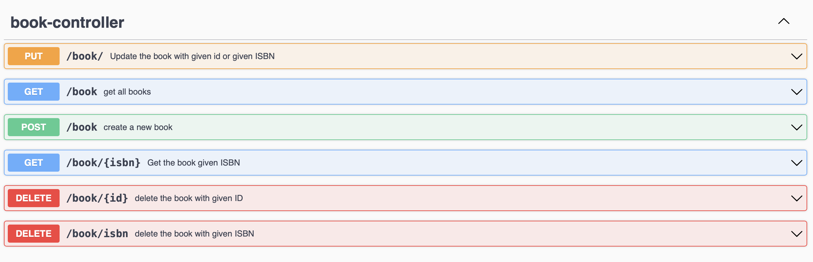
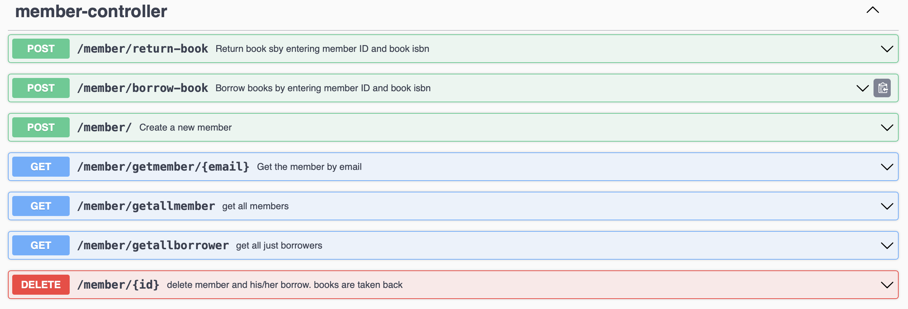

---
### veritabani(PostgreSQL) ayarlamalarimizi yapmak icin resources-> application.yml dosyasinin icinde

- baska bir veritabani kullanilacak ise: asagida belirtmeliyiz.
  -     driver-class-name: org.postgresql.Driver
  -     MySql icin:
        driver-class-name: com.mysql.cj.jdbc.Driver

- **ZebraAssignment** adinda bir veritabanı olusturulmali veya kullanacagimiz 
veritabanimizi application.yml icerisinde belirtmeliyiz.
  -     url: jdbc:postgresql://localhost:5432/ZebraAssignment
  -     MySql icin:
        url: jdbc:mysql://localhost:3306/ZebraAssignment
- yine yaml dosyası icerisinde postgresql icin: **username ve password** kisimlarimizi
ayarlamamiz gerekiyor.
  -     username: postgres -> kendi veritabaniniz icin kullanici adiniz.
        password: asd123asd -> veritabani sifreniz.

---
### Deneme islemleri kolay olmasi icin regex eklenmedi.
### yukarida adimlar tamamlandi ise
### sistem 9090 portundan ayaga kalkmaktadir.
### http://localhost:9090/swagger-ui/index.html

---
### Book Document

- ayni ISBN'e sahip kitaplar olamaz.
- bir kitap ödünç alinmis ise kitap silinemez.
- güncelleme kisminda ister ISBN isterseniz ID ile güncelleme yapabilirsiniz.

---
### Member Document

- kitap kopyasi 0 ise üye bu kitabı ödünc alamaz.
- ayni mail adresine ait üyeler olamaz.
- get all member da tüm üyeler gösterilir.
- get all borrower da sadece kitap ödünç almış olanlar gösterilir.
- üyeye ait ödünç alinmiş kitaplar var ise üye silme isleminde
kitap kopyalari iade edilir ve kullanici silinir.
